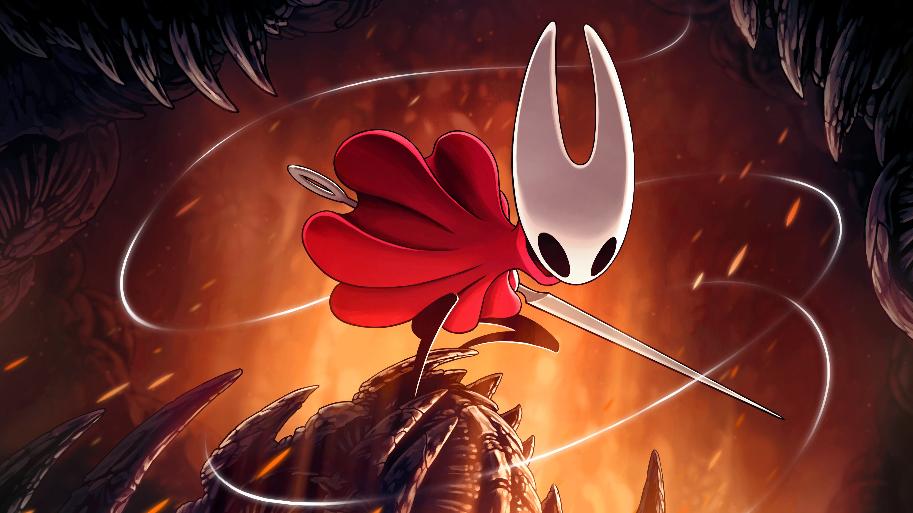
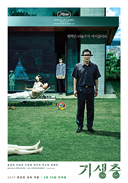
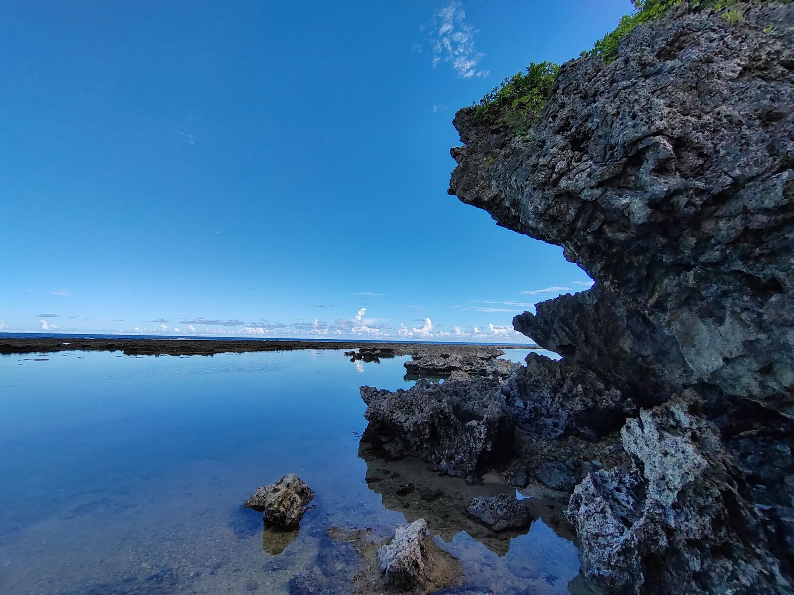
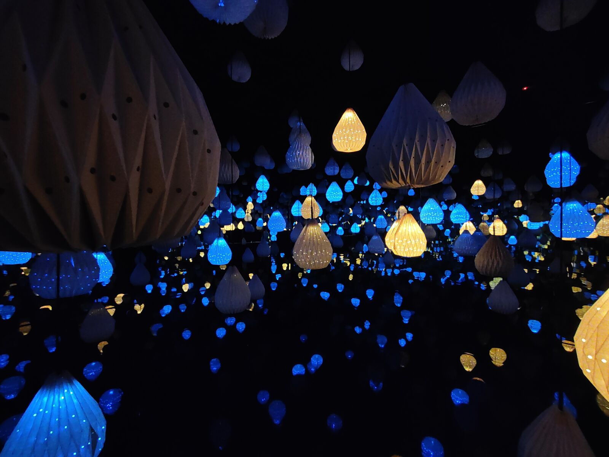
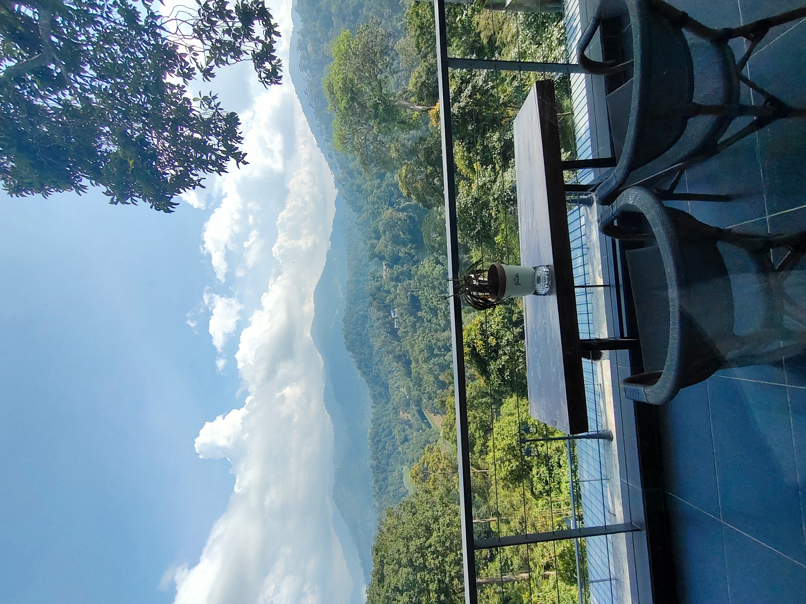
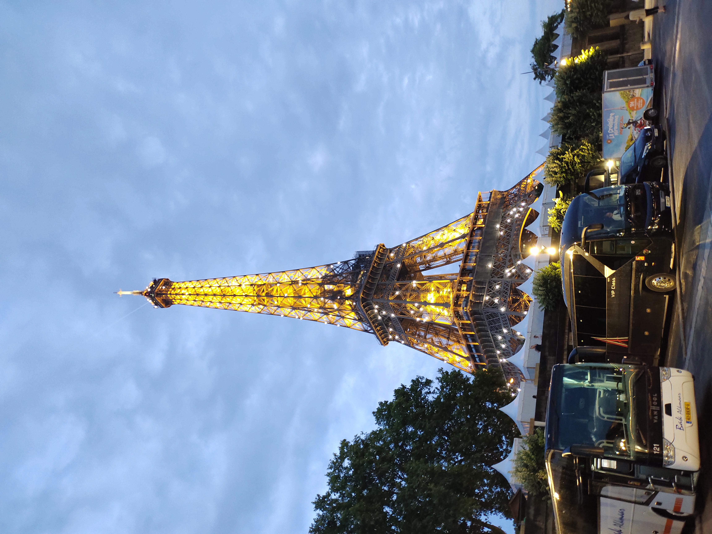
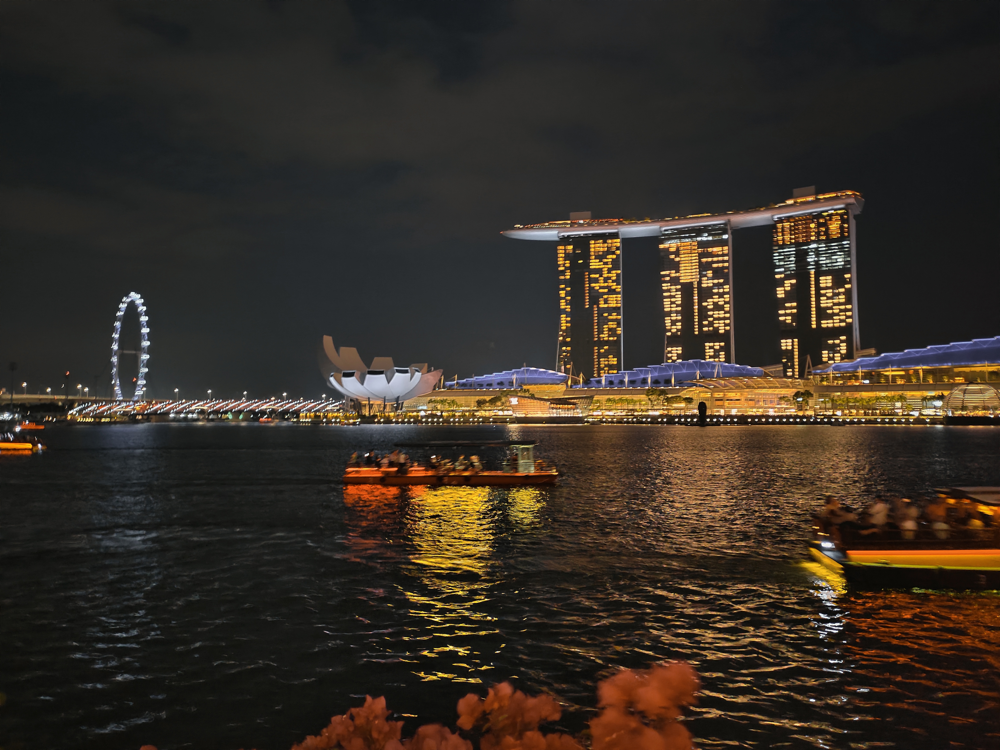
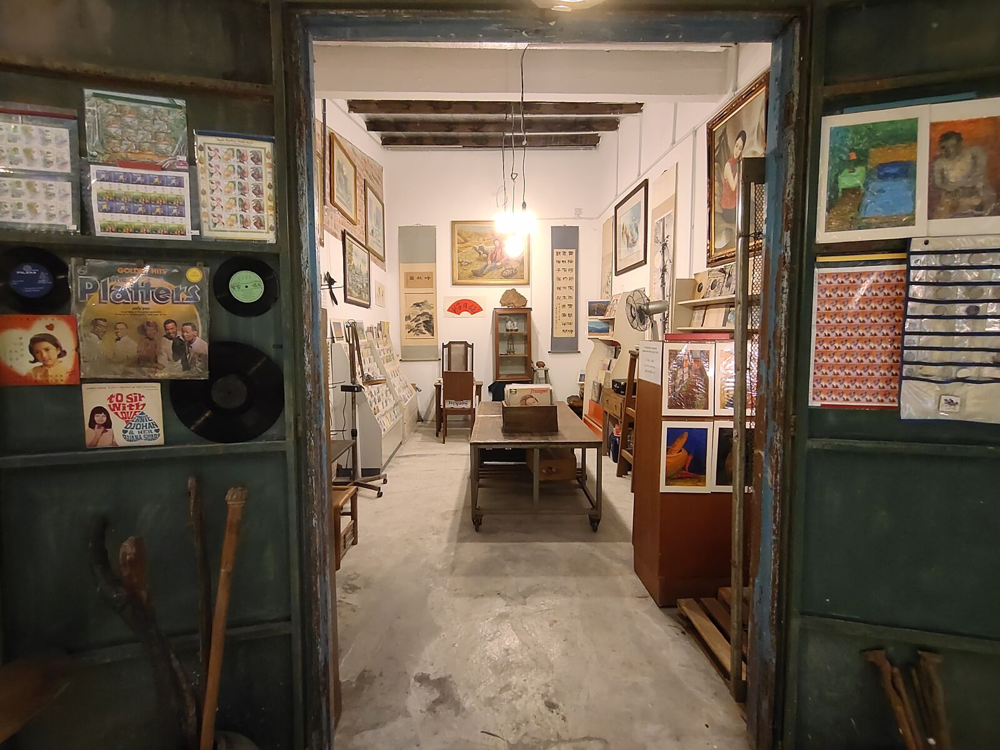
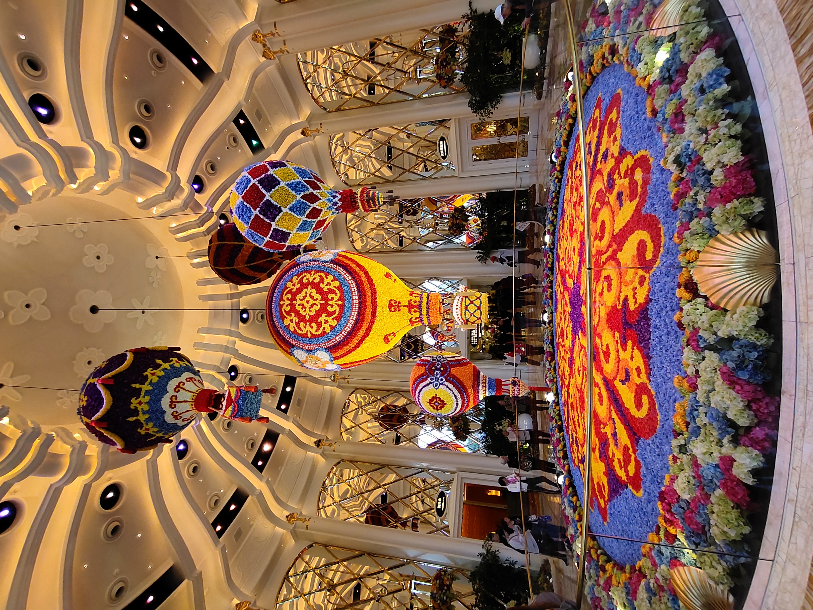
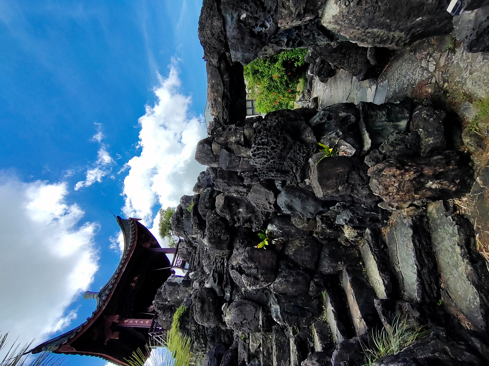

+++
date = '2026-05-26T16:00:07+08:00'
draft = false
description = 'A little bit about who I am and what I do.'

layout = "about"
+++

Hello! My online name is <mark>Bounde3d</mark> (pronounced Bounded)👋, a Computer Science graduate who likes to talk about IoT, software and other tech-related topics. Currently based in <strong class="text-accent">Malaysia</strong>, I'm interested in cybersecurity and building quirky projects. Outside of tech, I enjoy board games, taking photos of nature, and badminton.

---

## 🛠️ Programming Languages

  
  
  
  
  
  
  

## 🧰 Toolkit

  
  
  
  
  
  
  
  

---

## 📁 Projects


---

## 🎮 Favourite Games 

  <table style="width:100%; display:table; table-layout:fixed; font-size:19px;">
  <thead>
    <tr>
      <th style="width:20%;"> </th>
      <th style="width:40%;">Title</th>
      <th style="width:40%;">Developed By</th>
    </tr>
  </thead>
  <tbody>
    <tr>
      <td ></td>
      <td>Hollow Knight: Silksong</td>
      <td>Team Cherry</td>
    </tr>
    <tr>
      <td ></td>
      <td>Minecraft</td>
      <td>Mojang</td>
    </tr>
    <tr>
      <td ></td>
      <td>Ori and the Blind Forest</td>
      <td>Moon Studios</td>
    </tr>
  </tbody>
</table>

## 🍿 Favourite Movies 

  <table style="width:100%; display:table; table-layout:fixed; font-size:19px;">
  <thead>
    <tr>
      <th style="width:20%;"> </th>
      <th style="width:40%;">Title</th>
      <th style="width:40%;">Release Year</th>
    </tr>
  </thead>
  <tbody>
    <tr>
      <td ></td>
      <td>Project Hail Mary</td>
      <td>2026</td>
    </tr>
    <tr>
      <td ></td>
      <td>Everything Everywhere All at Once</td>
      <td>2022</td>
    </tr>
    <tr>
      <td ></td>
      <td>Parasite</td>
      <td>2019</td>
    </tr>
  </tbody>
</table>

---

## 📷 Gallery


Capturing moments, one frame at a time.



  
  
  
  
  
  
  
  
  
  
  
  
  
  
  
  
  
  
  
  
  
  
  
  
  
  
  
  
  
  


