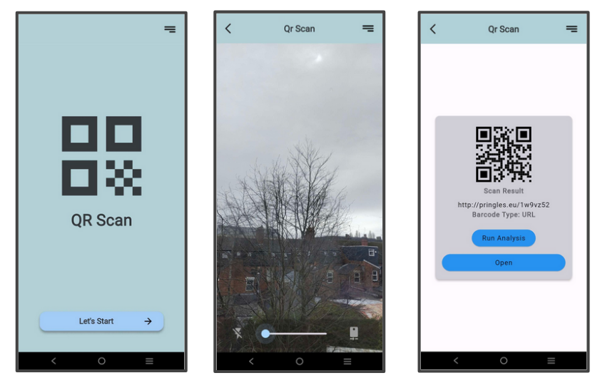
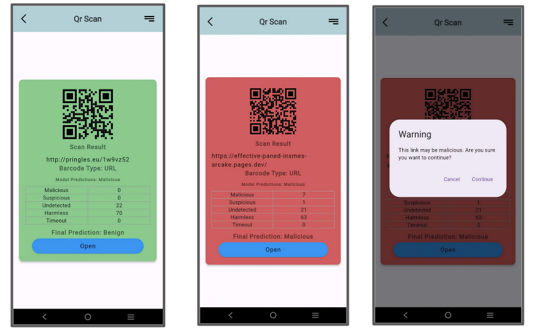

+++
date = '2025-12-12T19:08:43+08:00'
draft = false
title = 'Safe QR Scanner'
description = "a simple and personal flutter & AI project"
showTableOfContents = true
+++

A Flutter-based mobile application that scans QR codes and detects malicious URLs using a combination of existing blacklist APIs and a custom-trained machine learning model to detect zero-days threats.
<!--more-->



---

## 📖 Overview


 Python 
 Flutter 
 Android 
 AI 


QR codes have become a common part of everyday life — found on restaurant menus,
billboards, product packaging, and emails. However, this convenience has made them
an increasingly attractive vector for phishing attacks and malware distribution.

While modern smartphones offer basic link protection, these checks typically occur
**after** a URL is opened — exposing users to credential harvesting, drive-by
downloads, and other web-based attacks before any warning is shown. Additionally it does not 
offer protection against zero-day threats.

Thus I have decided to try my hands on making a **Safe QR Scanner Application**.  
<em>Also an attempt to learn mobile application development</em>

The application combines real-time blacklist API lookups with a custom-trained
machine learning model to provide a multi-layered threat assessment at scan time, giving users
a clear verdict on whether a scanned QR code is safe to open.

  
  

## ⚡ Features

- 📷 **Camera scanning** — scan QR codes in real time using your device camera
- 🔍 **Full QR code details** — view the decoded content, type, and metadata
- 🛡️ **Multi-vendor threat analysis** — checks the URL against existing blacklist APIs
- 🤖 **Custom ML model** — runs a Naive Bayes classifier trained on real phishing and legitimate URLs
- 📊 **Analysis report** — shows vendor results and a final prediction (safe / malicious)

---

## 🏗️ Architecture



The system uses a two-layer detection pipeline combining existing blacklist and machine learning to improve URL classification accuracy.

#### Layer 1: Blacklist Check
Scanned QR code URLs are first checked against the [**VirusTotal API ↗**](https://docs.virustotal.com/reference/url-info) to quickly identify known malicious links. If flagged, the URL is immediately classified as malicious.

#### Layer 2: ML Classification
If the URL is not found in the blacklist, it is processed through a [Flask API](#own-model-api) that extracts URL and host-based features and predicts whether the link is safe or malicious using a trained model.

#### Final Output
The final decision is based on both layers, classifying the URL as either **Safe** or **Malicious**.

This hybrid approach improves reliability by combining existing blacklist with a trained predictive model, enabling more robust detection of newly emerging malicious URLs.

---

## 🤖 Machine Learning Model

The detection model is a `binary classifier` trained to distinguish between **phishing** 
and **legitimate** URLs. Rather than relying solely on blacklists — which miss zero-day 
phishing sites — the model learns patterns from URL structure and host behaviour that 
are consistent across phishing attempts regardless of whether the domain is known.

### Dataset

The model was trained on URLs gathered from [**OpenPhish ↗** ](https://openphish.com/phishing_database.html) and [**Cloudflare ↗**](https://radar.cloudflare.com/domains), containing both phishing and legitimate URLs. These URL are then passed onto [**Urlscan.io API ↗**](https://urlscan.io/) to gather both lexical and host based features.


Only **live** sites were included since host-based features require active web requests.


The dataset was preprocessed by :
- removing duplicate records 
- applying Min-Max scaling to numerical features
- generating hashed representations for categorical and missing-value features

These steps improved data consistency, normalized feature values, and prepared the dataset for model training.

### Feature Selection

The custom model extracts **28 features** from each URL, split into two categories:




Features derived purely from the URL string — no network requests needed.

| # | Feature | Description |
|---|----------------|----------------------|
| 1 | URL length | Total length of the URL |
| 2 | netloc length | Length of the network location |
| 3 | Query length | Length of the query string |
| 4 | Digit count | Number of digits in the URL |
| 5 | Reserved char count | Number of reserved characters |
| 6 | Has HTTPS | Whether the site uses HTTPS |
| 7 | Country Code TLD | Country of origin from TLD |
| 8 | Is shortened | Whether it's a URL shortener |
| 9 | Has port | Whether a port is specified |
| 10 | Has username | Whether a username is in the URL |
| 11 | Has fragments | Whether fragments are present |
| 12 | Num queries | Number of query parameters |
| 13 | URL encoding | Count of URL-encoded characters |
| 14 | Path length | Length of the path component |
| 15 | Path depth | Number of path segments |
| 16 | Path digit count | Digits in the path |
| 17 | Path special chars | Special characters in the path |
| 18 | Has .exe or .php | Whether path ends with `.exe` or `.php` |




Features gathered by making live requests to the URL — requires network access.

| # | Feature | Description |
|---|---------|-------------|
| 19 | Page title | Whether the page has a title |
| 20 | MIME type | Whether content type is non-standard |
| 21 | Redirected | Whether the page redirects |
| 22 | Ranking | Cisco-based page ranking |
| 23 | Country | Server deployment country |
| 24 | TLS valid days | TLS certificate validity period |
| 25 | Num requests | Number of HTTP requests made |
| 26 | Num links | Number of hyperlinks on the page |
| 27 | Num cookies | Number of cookies set |
| 28 | Num console messages | Number of browser console messages |
      


### Model Selection

The dataset was split using a 70:30 train-test ratio, and several machine learning classifiers were trained and evaluated through k-fold cross-validation using precision as the primary scoring metric to select the best-performing model.



#### Model Score

| Classifier | Accuracy | Recall | Precision | F1-Score |
|-----------|----------|--------|-----------|----------|
| **BernoulliNB** | **0.9412** | **0.9399** | **0.9425** | **0.9411** |
| RandomForestClassifier | 0.9235 | 0.9210 | 0.9248 | 0.9230 |
| AdaBoostClassifier | 0.9127 | 0.9103 | 0.9143 | 0.9117 |
| DecisionTreeClassifier | 0.8974 | 0.8951 | 0.8989 | 0.8970 |
| SVC | 0.8614 | 0.8614 | 0.8806 | 0.7972 |

>[!done]**Naive Bayes (BernoulliNB)** 
> Selected model having the highest score overall.

---

## ⚙️ Model API {#own-model-api}

A RESTful API was developed using [Flask ↗](https://flask.palletsprojects.com/) to serve the trained machine learning model. The API receives a URL from the client, performs the data preprocessing, and extracting additional host-based features via the [**Urlscan.io API ↗**](https://urlscan.io/). These features are then passed to the model to predict whether the URL is malicious or benign. The prediction result is returned as a <abbr title="JavaScript Object Notation">JSON</abbr> response and displayed in the application interface.

> [!note]
> This API can be deployed on a cloud instance such as an AWS EC2 instance for public access.
>
> However, as this is a passion project, it is currently hosted locally on the development machine.

---

## 🧠 What I Learned

Overall, this project strengthened my understanding of mobile application development, backend services, and machine learning models to create my **Safe QR Scanner**!

The github repo can be found here →


---

